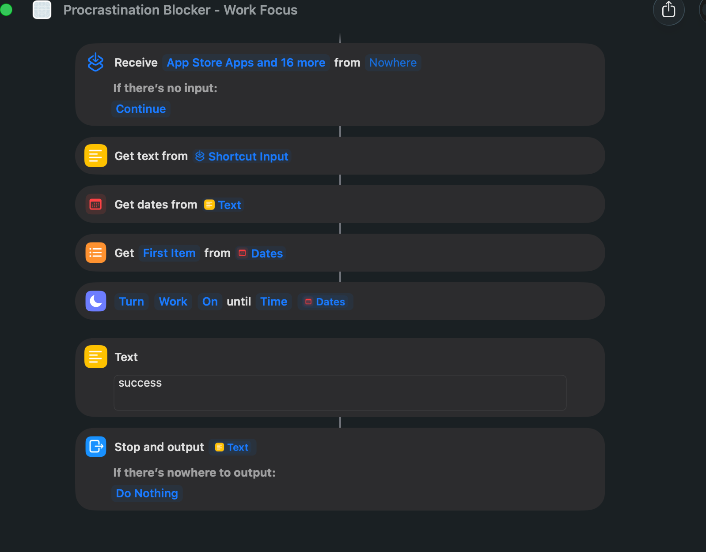

# Work Focus Shortcut

Procrastination Blocker cannot activate Work Focus through a direct Focus API
because macOS does not expose one publicly. It calls Apple's public
`/usr/bin/shortcuts` command and supplies a temporary text file containing one
ISO-8601 deadline, such as `2026-07-16T18:30:00-06:00`.

## Create the Shortcut

1. Open the Shortcuts app on macOS.
2. Create a new Shortcut named exactly **Procrastination Blocker - Work Focus**.
3. Add **Get Text from Input** and set its input to **Shortcut Input**. This
   reads the contents of the file supplied by `shortcuts --input-path`.
4. Add **Get Dates from Input** and use the Text from the previous action.
5. Optionally add **Get Item from List**, choose **First Item**, and use the
   Dates from the previous action. The tested configuration below includes
   this action, although the Focus action can consume the single-item Dates
   output directly.
6. Add **Set Focus** and configure it as **Turn Work On until Time**. Control-click
   the time field, choose **Select Variable**, and select **Dates** from the
   **Get Dates from Input** action.
7. Add a **Text** action containing `success`.
8. Add **Stop and Output**, using the `success` Text as its output.

The effective action chain is:

```text
Shortcut Input
-> Get Text from Input
-> Get Dates from Input
-> Set Focus: Work, On, until Time [Dates]
-> Text: success
-> Stop and Output
```

## Reference configuration

This exact configuration was tested through `/usr/bin/shortcuts` and returned
`success` while activating Work Focus with the supplied deadline:



The Shortcut consumes the deadline from its input; it must not substitute a
fixed duration or a hard-coded date.

## Test the Shortcut

This macOS-only command creates an ISO-8601 deadline five minutes in the
future, passes it as the Shortcut input, and removes the temporary file:

```sh
deadline_file="$(mktemp -t procrastination-blocker-deadline)"
date -u -v+5M '+%Y-%m-%dT%H:%M:%SZ' > "$deadline_file"
/usr/bin/shortcuts run "Procrastination Blocker - Work Focus" --input-path "$deadline_file"
rm -f "$deadline_file"
```

The command should print `success`, and Work Focus should show that it is on
until the generated date. This command-line flow was verified successfully on
July 16, 2026. Turn Work Focus off manually after testing if needed.

## Share Across Devices

Enable **Share Across Devices** in System Settings > Focus if Work Focus should
also turn on for other Apple devices using the same Apple Account. This only
synchronizes Focus state. Website blocking remains local to the Mac running
Procrastination Blocker.

If the Shortcut is missing, its input cannot be parsed, or Focus activation
fails, the app reports that error. The already-started website block remains
active until its root-owned deadline.
